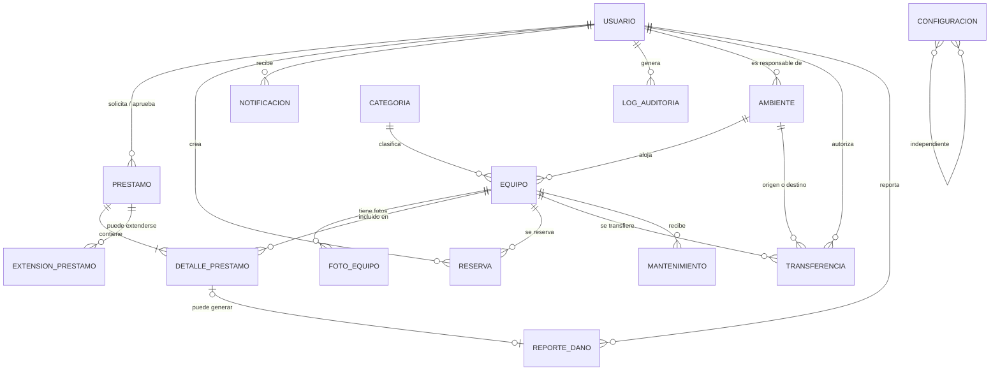
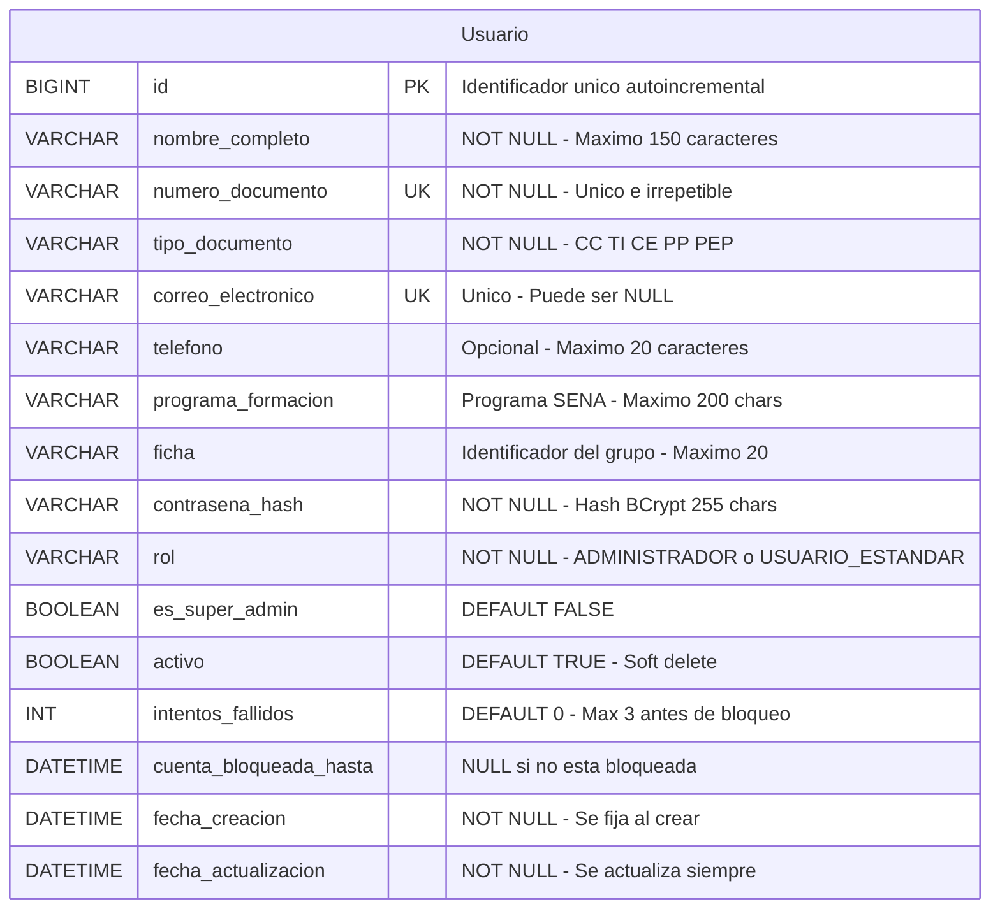
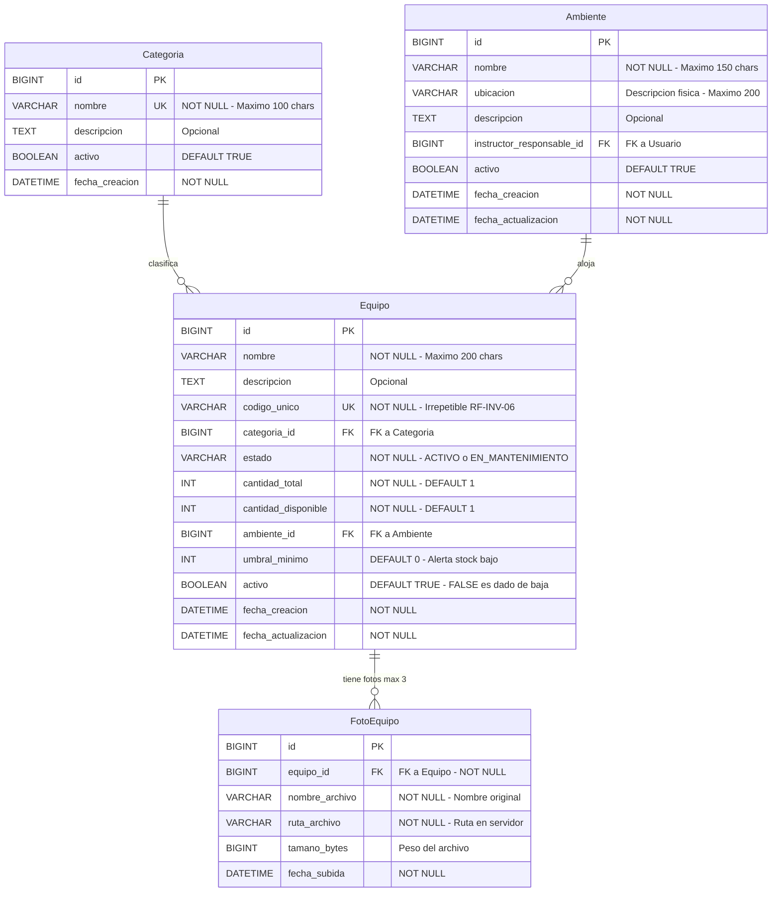
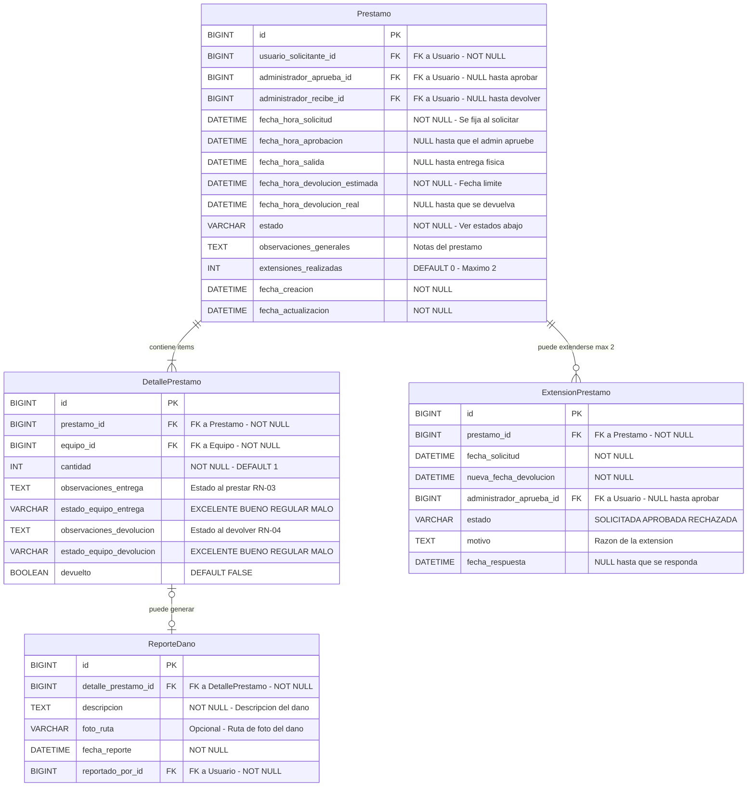
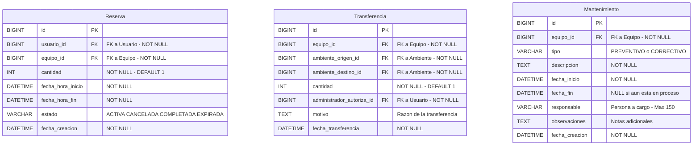
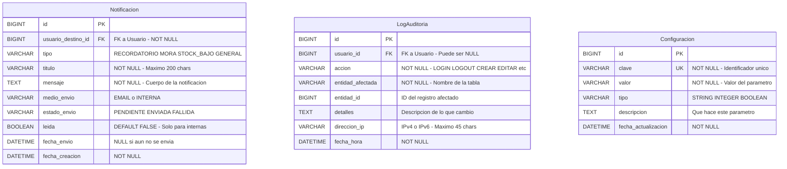
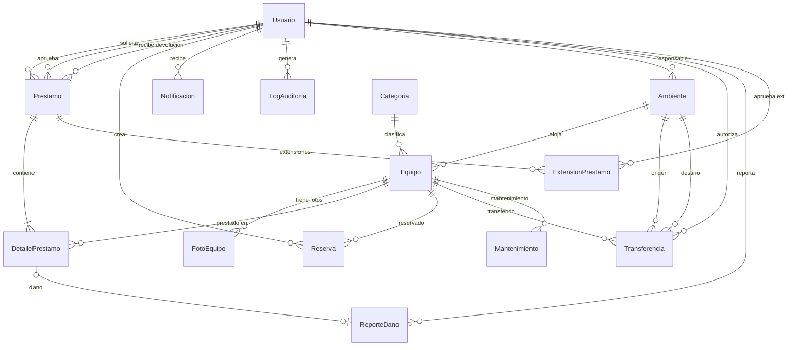
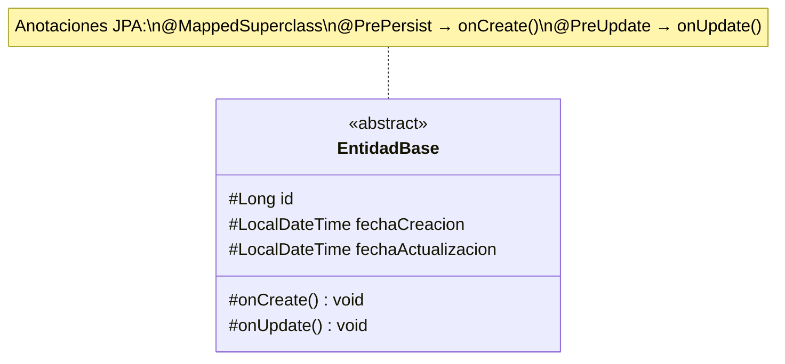
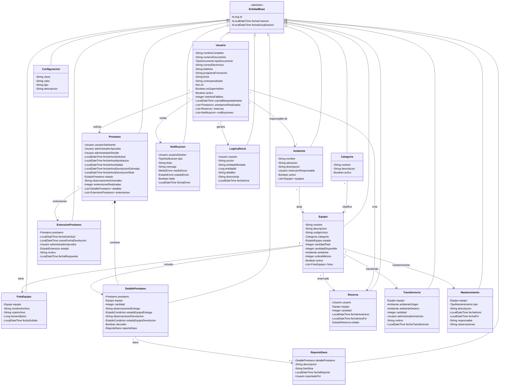

# SIGEA – Diagramas de Diseño del Modelo de Datos

**Versión:** 1.0  
**Fecha:** 16 de febrero de 2026  
**Autor:** Camilo López Romero  

> **Nota:** Para visualizar los diagramas Mermaid en VS Code, instala la extensión
> **"Markdown Preview Mermaid Support"** o **"Mermaid Markdown Syntax Highlighting"**.

---

## 1. Proceso: De los Requerimientos a las Entidades

Antes de dibujar cualquier diagrama, necesitamos **extraer las entidades** (las "cosas" del mundo real que el sistema necesita recordar) directamente de los requerimientos. La regla es simple:

> **Si el sistema necesita almacenar, consultar o modificar información sobre algo → eso es una entidad.**

---

## 2. Entidades Identificadas

| # | Entidad | Descripción | Requerimientos origen | Módulo | Prioridad |
|---|---------|-------------|----------------------|--------|-----------|
| 1 | **Usuario** | Personas que interactúan con el sistema (admins y estándar) | RF-USR-01 a RF-USR-06, RS-AUT-01 a RS-AUT-05 | Usuarios | Must |
| 2 | **Categoria** | Clasificación de equipos (herramientas manuales, equipos de medición, etc.) | RF-INV-05 | Inventario | Must |
| 3 | **Ambiente** | Espacios físicos de formación donde se ubican los equipos | RF-AMB-01 a RF-AMB-05 | Multi-ambiente | Should |
| 4 | **Equipo** | Herramientas, dispositivos e instrumentos del inventario | RF-INV-01 a RF-INV-10 | Inventario | Must |
| 5 | **FotoEquipo** | Fotografías asociadas a cada equipo (máx. 3) | RF-INV-07 | Inventario | Should |
| 6 | **Prestamo** | Registro maestro de un préstamo (cabecera) | RF-PRE-01 a RF-PRE-10 | Préstamos | Must |
| 7 | **DetallePrestamo** | Cada equipo incluido dentro de un préstamo (líneas) | RF-PRE-03, RF-PRE-04, RF-PRE-10 | Préstamos | Must |
| 8 | **ExtensionPrestamo** | Solicitudes de extensión de un préstamo activo (máx. 2) | RF-PRE-07 | Préstamos | Should |
| 9 | **ReporteDano** | Registro de daño al devolver un equipo en mal estado | RF-PRE-08, RN-05 | Préstamos | Should |
| 10 | **Reserva** | Reserva anticipada de equipos (máx. 5 días hábiles) | RF-RES-01 a RF-RES-04 | Reservas | Could |
| 11 | **Transferencia** | Movimiento de equipos entre ambientes de formación | RF-AMB-04, RN-10 | Multi-ambiente | Should |
| 12 | **Mantenimiento** | Historial de reparaciones y mantenimientos por equipo | RF-INV-10 | Inventario | Could |
| 13 | **Notificacion** | Registro de cada notificación enviada o mostrada | RF-NOT-01 a RF-NOT-06 | Notificaciones | Must |
| 14 | **LogAuditoria** | Registro de acciones críticas para trazabilidad | RS-AUD-01, RS-AUD-02 | Sistema | Must |
| 15 | **Configuracion** | Parámetros configurables del sistema (clave-valor) | RF-NOT-04, RS-AUT-03, RS-AUT-04 | Sistema | Should |

**Total: 15 entidades** que cubren todos los módulos del sistema.

---

## 3. Diagrama Entidad-Relación Conceptual

Este diagrama muestra **QUÉ entidades existen** y **CÓMO se relacionan entre sí**, sin entrar en detalles de columnas ni tipos de datos. Es el "mapa general" del sistema.

### ¿Cómo leer este diagrama?

| Símbolo | Significado | Ejemplo |
|---------|------------|---------|
| `\|\|` | Exactamente uno (obligatorio) | Un préstamo tiene exactamente un solicitante |
| `o\|` | Cero o uno (opcional) | Un detalle de préstamo puede tener cero o un reporte de daño |
| `\|{` | Uno o más (obligatorio múltiple) | Un préstamo tiene al menos un detalle |
| `o{` | Cero o más (opcional múltiple) | Un usuario puede tener cero o muchos préstamos |



### Explicación de las Relaciones Clave

| Relación | Cardinalidad | ¿Por qué? |
|----------|-------------|-----------|
| Usuario → Préstamo | 1:N | Un usuario puede solicitar muchos préstamos. Además, un admin aprueba y otro puede recibir la devolución (3 relaciones diferentes al mismo `Usuario`). |
| Préstamo → DetallePréstamo | 1:N | Un préstamo puede incluir **varios equipos** (RF-PRE-03 dice "equipo**s** prestado**s**"). Cada línea es un `DetallePrestamo`. |
| Equipo → DetallePréstamo | 1:N | Un mismo tipo de equipo puede aparecer en muchos préstamos diferentes a lo largo del tiempo. |
| Equipo → FotoEquipo | 1:N (máx. 3) | RF-INV-07 permite hasta 3 fotos por equipo. Se almacenan como registros separados. |
| Categoría → Equipo | 1:N | Cada equipo pertenece a exactamente una categoría. Una categoría agrupa muchos equipos. |
| Ambiente → Equipo | 1:N | Cada equipo está ubicado en un ambiente. Un ambiente tiene muchos equipos. |
| Préstamo → ExtensionPrestamo | 1:N (máx. 2) | RN-02: máximo 2 extensiones por préstamo. |
| DetallePréstamo → ReporteDaño | 1:0..1 | Solo se genera reporte de daño si el equipo se devuelve en mal estado (RN-05). |
| Ambiente → Transferencia | Doble 1:N | Cada transferencia tiene un ambiente origen y uno destino (dos FKs al mismo `Ambiente`). |

---

## 4. Modelo Relacional – Diagrama de Base de Datos (Físico)

Este diagrama muestra las **tablas reales** que se crearán en MariaDB, con sus **columnas, tipos de datos, llaves primarias (PK) y llaves foráneas (FK)**.

### Convenciones de Nombrado

| Elemento | Convención | Ejemplo |
|----------|-----------|---------|
| Tablas | `snake_case`, singular | `usuario`, `detalle_prestamo` |
| Columnas | `snake_case` | `nombre_completo`, `fecha_creacion` |
| Primary Key | Siempre `id`, tipo `BIGINT`, autoincremental | `id BIGINT PK` |
| Foreign Key | `nombre_entidad_id` | `usuario_id`, `ambiente_id` |
| Campos de auditoría | Presentes en todas las tablas | `fecha_creacion`, `fecha_actualizacion` |
| Soft delete | Campo `activo` tipo `BOOLEAN` | Solo en entidades que lo requieran |

### 4.1 Tabla: Usuario



**¿Por qué estos campos?**
- `contrasena_hash`: RS-CIF-01 exige hash BCrypt, **nunca texto plano**.
- `es_super_admin`: RF-AMB-05 distingue al primer admin que puede gestionar todos los ambientes.
- `intentos_fallidos` + `cuenta_bloqueada_hasta`: RS-AUT-03, bloqueo tras 3 intentos (5 min → 15 min).
- `activo`: RF-USR-03, la eliminación es **lógica** (el registro no se borra).

### 4.2 Tablas: Inventario



**¿Por qué `cantidad_total` y `cantidad_disponible`?**
- RF-INV-01 incluye `cantidad` como campo del equipo. Ejemplo: "Cable UTP Cat6" puede tener 50 unidades.
- `cantidad_disponible` se **decrementa** al prestar y se **incrementa** al devolver (RF-PRE-10).
- Un equipo está "disponible" cuando: `activo = TRUE`, `estado = 'ACTIVO'` y `cantidad_disponible > 0`.

**¿Por qué `Categoria` es una tabla y no un ENUM?**
- Principio **Open/Closed (SOLID)**: Si mañana se agrega una categoría nueva, solo se inserta un registro en la tabla. **No se modifica código**.

**¿Por qué las fotos van en tabla separada?**
- **Normalización**: Un equipo puede tener 0, 1, 2 o 3 fotos. Si pusiéramos `foto1`, `foto2`, `foto3` como columnas en `equipo`, violaríamos la Primera Forma Normal (1FN) que dice "no puede haber grupos repetitivos".

### 4.3 Tablas: Préstamos



**Estados del Préstamo (ciclo de vida):**

```
SOLICITADO → APROBADO → ACTIVO → DEVUELTO
     │                    │
     ↓                    ↓
  RECHAZADO            EN_MORA → DEVUELTO
     │
     ↓
  CANCELADO
```

- `SOLICITADO`: El usuario creó la solicitud, esperando aprobación del admin.
- `APROBADO`: El admin autorizó pero aún no se ha hecho la entrega física.
- `ACTIVO`: El equipo fue entregado al usuario.
- `DEVUELTO`: El equipo fue devuelto y recibido.
- `RECHAZADO`: El admin denegó la solicitud.
- `EN_MORA`: Pasó la fecha de devolución estimada sin devolución (RF-PRE-06).
- `CANCELADO`: El usuario canceló la solicitud antes de la aprobación.

**¿Por qué `DetallePrestamo` como tabla separada?**
- Esto es un patrón clásico de diseño: **Cabecera-Detalle** (Master-Detail), igual que una factura con sus líneas.
- Un préstamo = la cabecera (quién, cuándo, estado general).
- Cada detalle = un equipo específico con su cantidad y observaciones.
- Esto resuelve la relación **muchos-a-muchos** entre `Prestamo` y `Equipo`.

**¿Por qué `devuelto` en DetallePrestamo?**
- Permite **devoluciones parciales**: si presto 3 equipos, puedo devolver 2 hoy y 1 mañana. Esto es extensibilidad pensando a futuro.

### 4.4 Tablas: Reservas, Transferencias y Mantenimiento



**¿Por qué `Transferencia` tiene dos FKs a `Ambiente`?**
- RF-AMB-04 exige registrar "ambiente origen" y "ambiente destino". Ambos apuntan a la **misma tabla** `Ambiente`, pero representan conceptos diferentes. Esto se llama **relación reflexiva** (dos FKs de la misma tabla a otra).

**¿Por qué `Mantenimiento` está incluido aunque es "Could Have"?**
- Principio de **diseño para extensibilidad**: es mucho más fácil crear la tabla ahora (solo estructura, sin código) que alterar el modelo después cuando ya hay datos en producción.

### 4.5 Tablas: Sistema (Notificaciones, Auditoría, Configuración)



**¿Por qué `LogAuditoria.usuario_id` puede ser NULL?**
- Hay acciones del sistema que no las ejecuta un usuario humano (ej: una tarea programada que envía notificaciones automáticas). En esos casos, `usuario_id` es `NULL`.

**¿Por qué `Configuracion` es una tabla clave-valor?**
- Permite cambiar parámetros del sistema (ej: `sesion.timeout.minutos = 30`, `intentos.maximos = 3`, `stock.alerta.umbral = 5`) **sin modificar código ni redesplegar**. Solo se actualiza un registro en la BD.

---

## 5. Diagrama de Relaciones Completo

Este diagrama muestra **TODAS las tablas y TODAS las relaciones** del sistema en una sola vista:



---

## 6. Diagrama de Clases – Modelo de Dominio (Java / Spring Boot)

Este diagrama muestra cómo se traducen las tablas de la base de datos a **clases Java** (entidades JPA). Cada tabla se convierte en una clase con la anotación `@Entity` de JPA.

### 6.1 Enumeraciones (Enums)

Los valores fijos que no cambian se modelan como **enumeraciones** en Java. Esto da **seguridad de tipos** en tiempo de compilación: si escribes mal un valor, Java te avisa antes de ejecutar.

```mermaid
classDiagram
    class Rol {
        <<enumeration>>
        ADMINISTRADOR
        USUARIO_ESTANDAR
    }

    class TipoDocumento {
        <<enumeration>>
        CC
        TI
        CE
        PP
        PEP
    }

    class EstadoEquipo {
        <<enumeration>>
        ACTIVO
        EN_MANTENIMIENTO
    }

    class EstadoPrestamo {
        <<enumeration>>
        SOLICITADO
        APROBADO
        RECHAZADO
        ACTIVO
        DEVUELTO
        EN_MORA
        CANCELADO
    }

    class EstadoCondicion {
        <<enumeration>>
        EXCELENTE
        BUENO
        REGULAR
        MALO
    }

    class EstadoReserva {
        <<enumeration>>
        ACTIVA
        CANCELADA
        COMPLETADA
        EXPIRADA
    }

    class EstadoExtension {
        <<enumeration>>
        SOLICITADA
        APROBADA
        RECHAZADA
    }

    class TipoNotificacion {
        <<enumeration>>
        RECORDATORIO_VENCIMIENTO
        MORA
        STOCK_BAJO
        SOLICITUD_PRESTAMO
        GENERAL
    }

    class MedioEnvio {
        <<enumeration>>
        EMAIL
        INTERNA
    }

    class EstadoEnvio {
        <<enumeration>>
        PENDIENTE
        ENVIADA
        FALLIDA
    }

    class TipoMantenimiento {
        <<enumeration>>
        PREVENTIVO
        CORRECTIVO
    }
```



### 6.2 Clase Base (EntidadBase)

Todas las entidades comparten campos comunes: `id`, `fechaCreacion`, `fechaActualizacion`. Para no **repetir** estos campos en cada clase, creamos una **clase abstracta** de la que todas heredan.

**Principios aplicados:**
- **Herencia (POO)**: Las clases hijas obtienen automáticamente los campos de la clase padre.
- **DRY (Don't Repeat Yourself)**: Escribimos `id`, `fechaCreacion`, `fechaActualizacion` **una sola vez**.
- **Liskov Substitution (SOLID)**: Cualquier entidad puede ser tratada como `EntidadBase`.



### 6.3 Entidades del Dominio



### 6.4 Mapeo: Tabla BD ↔ Clase Java ↔ Convención de Nombres

| Base de Datos (snake_case) | Java (camelCase) | Anotación JPA |
|---------------------------|------------------|---------------|
| `usuario` | `Usuario` | `@Entity @Table(name = "usuario")` |
| `nombre_completo` | `nombreCompleto` | `@Column(name = "nombre_completo")` |
| `usuario_solicitante_id` | `usuarioSolicitante` | `@ManyToOne @JoinColumn(name = "usuario_solicitante_id")` |
| `prestamos` (no existe en BD) | `List<Prestamo> prestamos` | `@OneToMany(mappedBy = "usuarioSolicitante")` |

> **Regla clave**: En la BD usamos `snake_case` porque es la convención de SQL. En Java usamos `camelCase` porque es la convención de Java. **JPA se encarga de traducir** entre ambos mundos con `@Column(name = "...")`.

---

## 7. Decisiones de Diseño y Principios Aplicados

### 7.1 Principios POO Aplicados

| Principio | Dónde se aplica | Ejemplo concreto |
|-----------|----------------|-----------------|
| **Encapsulamiento** | Todos los campos son `private` (`-`) | Solo se accede mediante getters/setters. Los datos internos están protegidos. |
| **Herencia** | `EntidadBase` → Todas las entidades | `id`, `fechaCreacion`, `fechaActualizacion` se escriben una sola vez. |
| **Polimorfismo** | Enumeraciones con comportamiento | `EstadoPrestamo` puede tener métodos como `puedeExtenderse()` que retorna `true` solo si es `ACTIVO`. |
| **Abstracción** | `EntidadBase` es `abstract` | No se puede instanciar directamente. Solo sus hijos concretos existen. |

### 7.2 Principios SOLID Aplicados

| Principio | Aplicación |
|-----------|-----------|
| **S – Single Responsibility** | Cada entidad tiene una sola razón de existir. `Prestamo` solo maneja la cabecera. `DetallePrestamo` solo maneja los items. `ReporteDano` solo maneja daños. |
| **O – Open/Closed** | `Categoria` es una tabla, no un ENUM en código. Agregar categorías no requiere cambiar código. Las enumeraciones de estados se usan donde los valores son **verdaderamente fijos** (APROBADO/RECHAZADO no va a cambiar). |
| **L – Liskov Substitution** | Todas las entidades heredan de `EntidadBase`. Cualquier método que reciba `EntidadBase` funciona con cualquier entidad hija. |
| **I – Interface Segregation** | `activo` NO está en `EntidadBase` porque no todas las entidades necesitan soft-delete. Solo `Usuario`, `Equipo`, `Ambiente` y `Categoria` lo tienen. |
| **D – Dependency Inversion** | Las relaciones se definen por tipo abstracto cuando es posible. Los servicios dependerán de interfaces (Repository), no de implementaciones concretas. |

### 7.3 Clean Code Aplicado

| Práctica | Ejemplo |
|----------|---------|
| **Nombres descriptivos** | `fechaHoraDevolucionEstimada` en vez de `fhde` o `fecha2`. |
| **Sin abreviaciones** | `observacionesEntrega` en vez de `obs_ent`. |
| **Consistencia** | Todos los IDs son `Long`, todas las fechas son `LocalDateTime`, todos los textos largos son `String` (mapeado a `TEXT`). |
| **Sin números mágicos** | El máximo de extensiones (2), el máximo de fotos (3), los tiempos de bloqueo (5 min, 15 min) se almacenan en la tabla `Configuracion`, no hardcodeados. |

### 7.4 Normalización de la Base de Datos

| Forma Normal | Cómo se cumple |
|-------------|---------------|
| **1FN** | No hay grupos repetitivos. Las fotos no son `foto1, foto2, foto3` sino registros en `FotoEquipo`. |
| **2FN** | Todos los campos no-clave dependen de la clave primaria completa, no de una parte. |
| **3FN** | No hay dependencias transitivas. El nombre de la categoría no se guarda en `equipo`; solo su `categoria_id`. |

---

## 8. Resumen de Cardinalidades

| Relación | Tipo | Regla de Negocio |
|----------|------|-----------------|
| Usuario → Préstamo | 1:N | Un usuario puede solicitar muchos préstamos |
| Préstamo → DetallePréstamo | 1:N | Un préstamo contiene uno o más equipos |
| Equipo → DetallePréstamo | 1:N | Un equipo puede ser prestado muchas veces |
| Equipo → FotoEquipo | 1:N (max 3) | Máximo 3 fotos por equipo |
| Categoría → Equipo | 1:N | Una categoría agrupa muchos equipos |
| Ambiente → Equipo | 1:N | Un ambiente contiene muchos equipos |
| Ambiente → Usuario (responsable) | N:1 | Cada ambiente tiene un instructor responsable |
| Préstamo → ExtensionPréstamo | 1:N (max 2) | Máximo 2 extensiones por préstamo |
| DetallePréstamo → ReporteDaño | 1:0..1 | Solo si se devuelve dañado |
| Usuario → Reserva | 1:N | Un usuario puede tener muchas reservas |
| Equipo → Reserva | 1:N | Un equipo puede ser reservado muchas veces |
| Equipo → Transferencia | 1:N | Un equipo puede ser transferido muchas veces |
| Ambiente → Transferencia | Doble 1:N | Origen y destino son ambientes |
| Equipo → Mantenimiento | 1:N | Un equipo puede tener muchos mantenimientos |
| Usuario → Notificación | 1:N | Un usuario recibe muchas notificaciones |
| Usuario → LogAuditoría | 1:N | Un usuario genera muchas entradas de log |

---

> **Próximo paso:** Con estos diagramas aprobados, procederemos a crear la estructura de carpetas
> del proyecto (backend Spring Boot + frontend Angular) y configurar el entorno de desarrollo.

---

*Documento generado como parte del proyecto SIGEA – SENA CIMI*
