# SIGEA - Fuentes Mermaid

## 01 Arquitectura

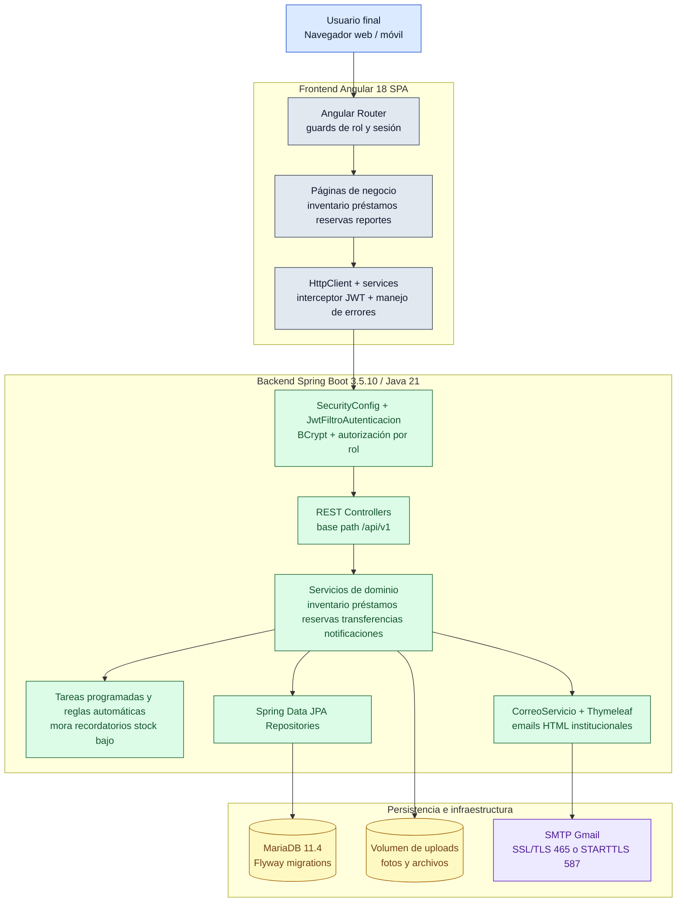

## 02 MER

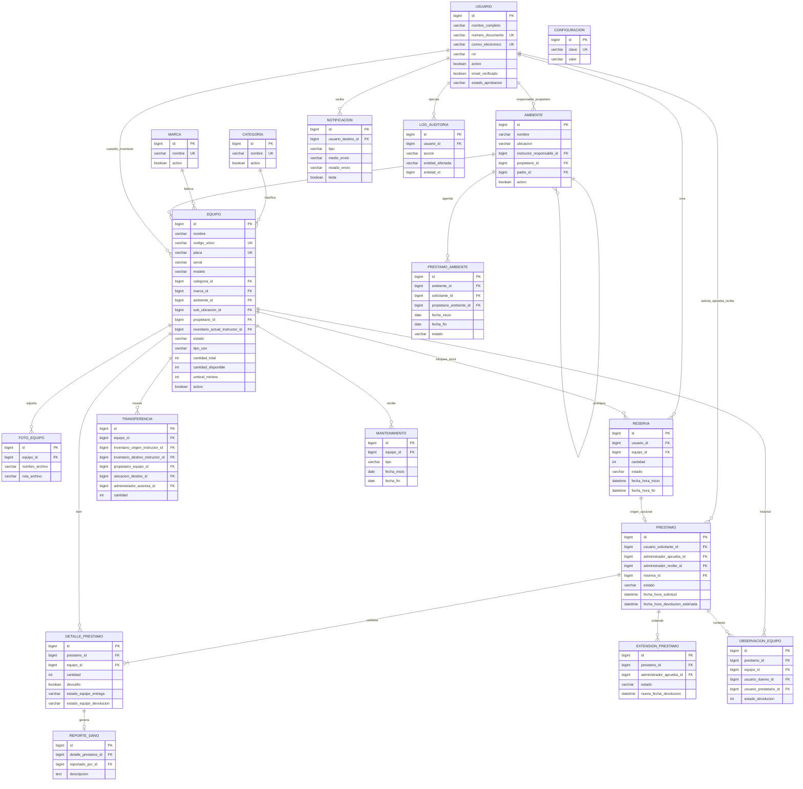

## 03 Clases UML

### 03a Dominio base e inventario

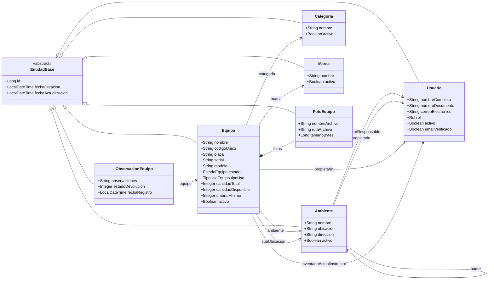

### 03b Dominio operativo de préstamos y reservas

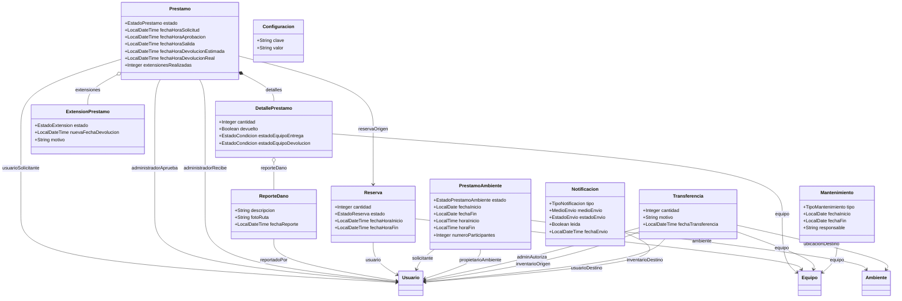

## 04a Flujo Prestamo

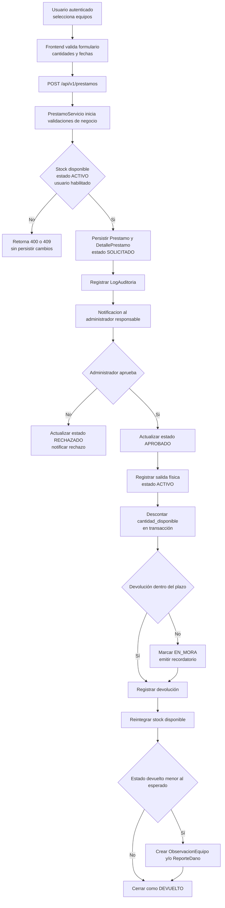

## 04b Flujo Autenticacion

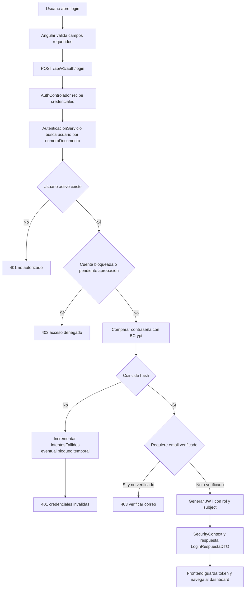

## 05 Casos de Uso

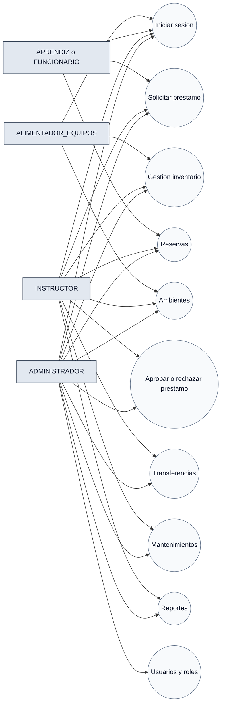

## 06a Secuencia Login

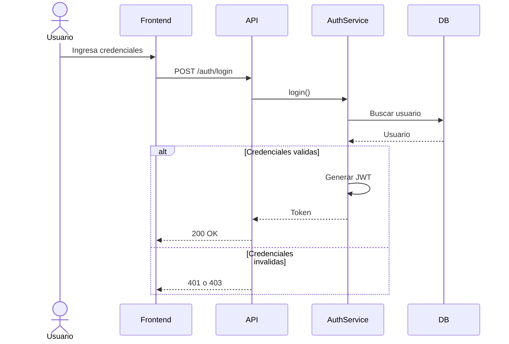

## 06b Secuencia Prestamo

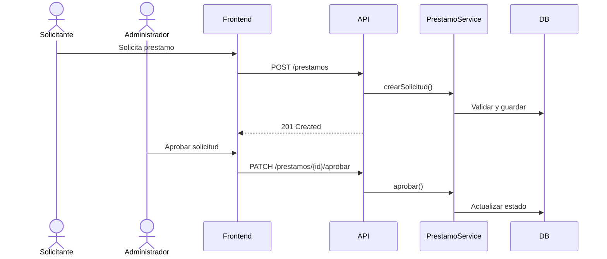

## 07 Componentes

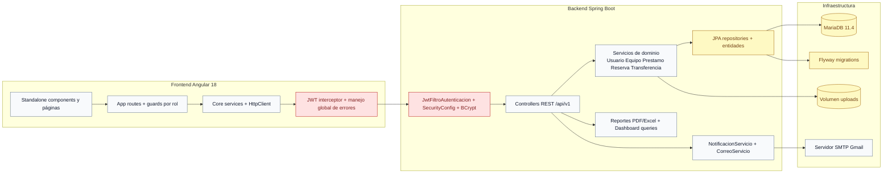

## 08 Despliegue

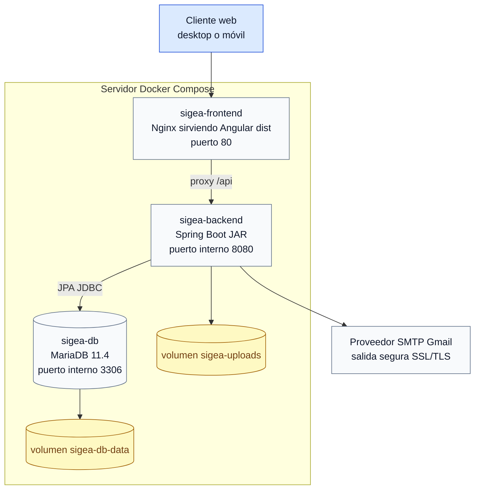
