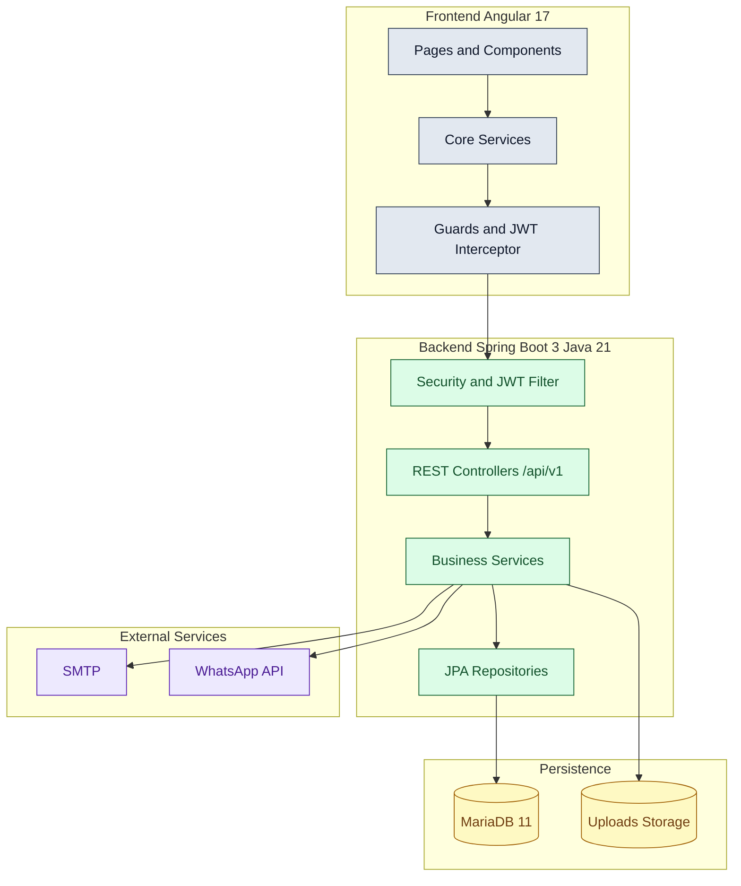
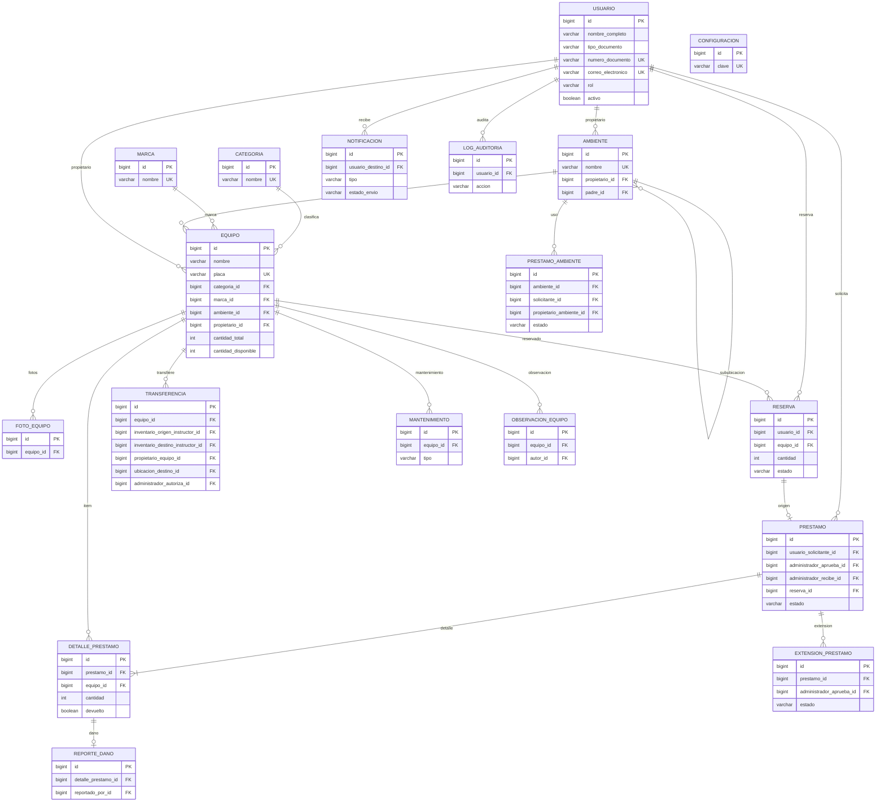
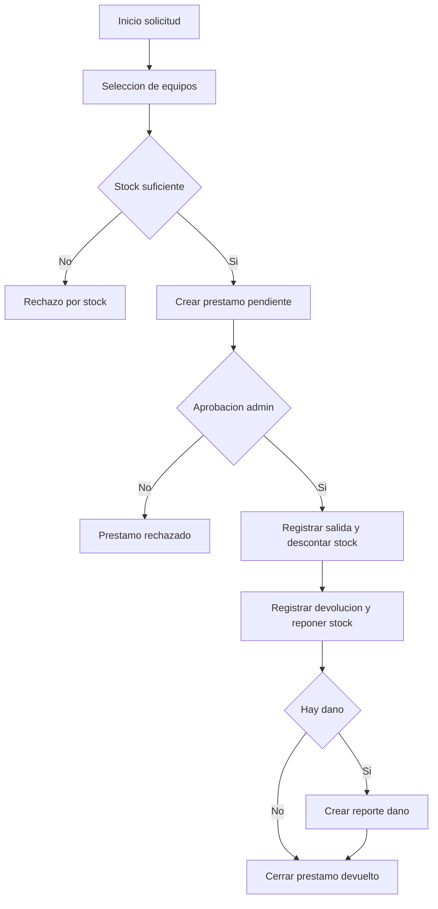
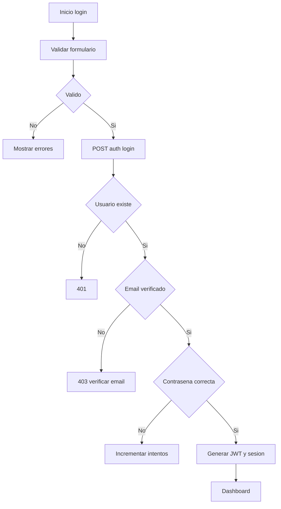
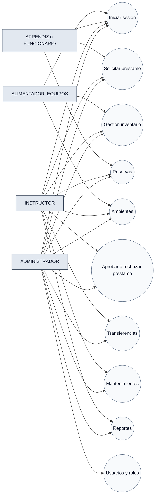
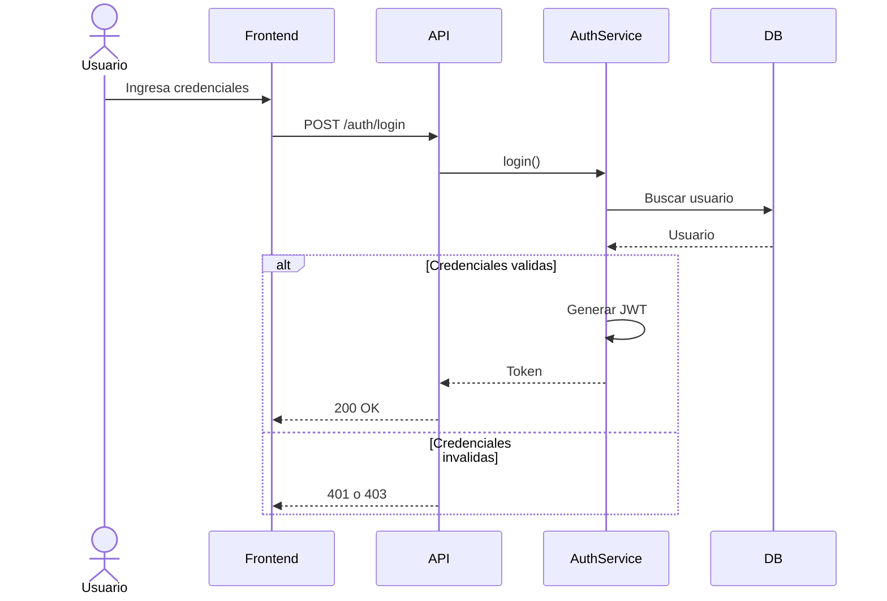
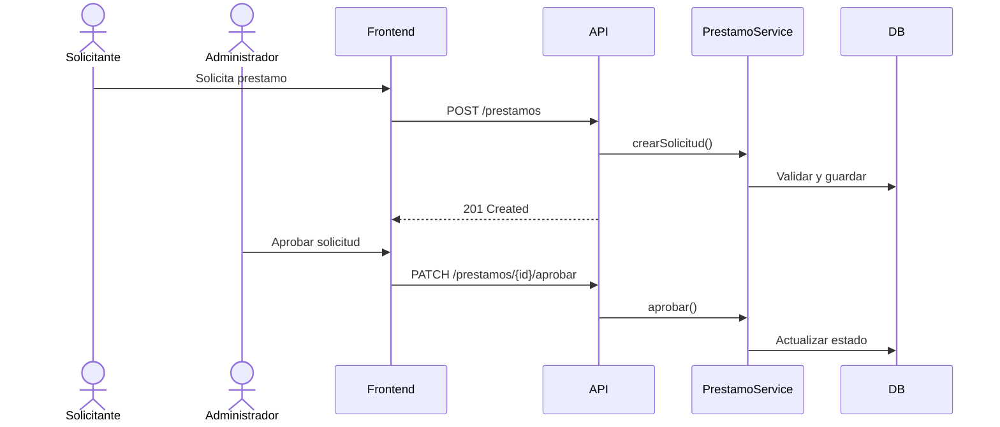
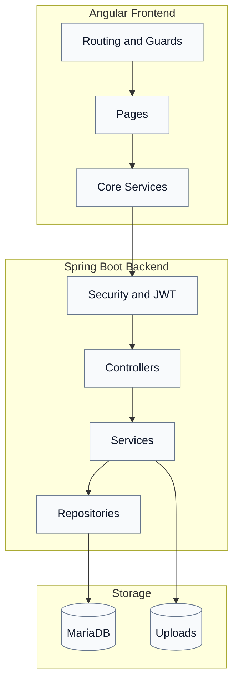
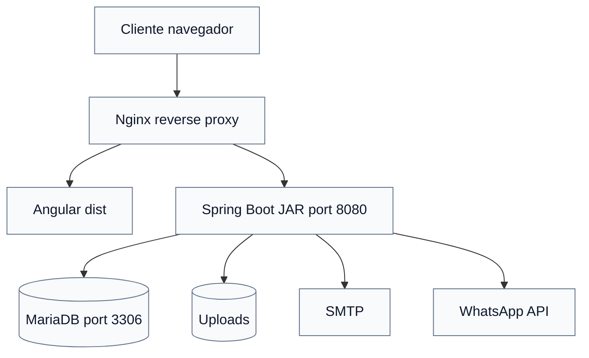

# SIGEA - Fuentes Mermaid

## 01 Arquitectura

## 02 MER

## 03 Clases UML

```mermaid
classDiagram
    class EntidadBase { +id: Long +fechaCreacion: LocalDateTime +fechaActualizacion: LocalDateTime }
    class Usuario { +nombreCompleto: String +correoElectronico: String +rol: Rol +activo: boolean }
    class Ambiente { +nombre: String +ubicacion: String +activo: boolean }
    class Categoria { +nombre: String +activo: boolean }
    class Marca { +nombre: String +activo: boolean }
    class Equipo { +nombre: String +placa: String +estado: EstadoEquipo +cantidadTotal: int +cantidadDisponible: int }
    class FotoEquipo { +nombreArchivo: String +rutaArchivo: String }
    class Prestamo { +estado: EstadoPrestamo +fechaSolicitud: LocalDateTime }
    class DetallePrestamo { +cantidad: int +devuelto: boolean }
    class ExtensionPrestamo { +estado: EstadoExtension }
    class ReporteDano { +descripcion: String }
    class Reserva { +cantidad: int +estado: EstadoReserva }
    class Transferencia { +cantidad: int +motivo: String }
    class Mantenimiento { +tipo: TipoMantenimiento }
    class ObservacionEquipo { +texto: String }
    class PrestamoAmbiente { +estado: EstadoPrestamoAmbiente }
    class Notificacion { +tipo: TipoNotificacion +estadoEnvio: EstadoEnvio }
    class Configuracion { +clave: String +valor: String }

    EntidadBase <|-- Usuario
    EntidadBase <|-- Ambiente
    EntidadBase <|-- Categoria
    EntidadBase <|-- Marca
    EntidadBase <|-- Equipo
    EntidadBase <|-- FotoEquipo
    EntidadBase <|-- Prestamo
    EntidadBase <|-- DetallePrestamo
    EntidadBase <|-- ExtensionPrestamo
    EntidadBase <|-- ReporteDano
    EntidadBase <|-- Reserva
    EntidadBase <|-- Transferencia
    EntidadBase <|-- Mantenimiento
    EntidadBase <|-- ObservacionEquipo
    EntidadBase <|-- PrestamoAmbiente
    EntidadBase <|-- Notificacion
    EntidadBase <|-- Configuracion

    Equipo --> Categoria : categoria
    Equipo --> Ambiente : ambiente
    Equipo --> Marca : marca
    Equipo --> Usuario : propietario
    Equipo *-- FotoEquipo : fotos
    Ambiente --> Usuario : propietario
    Ambiente --> Ambiente : padre
    Prestamo --> Usuario : solicitante
    Prestamo --> Usuario : adminAprueba
    Prestamo --> Usuario : adminRecibe
    Prestamo *-- DetallePrestamo : detalles
    Prestamo o-- ExtensionPrestamo : extensiones
    DetallePrestamo --> Equipo : equipo
    DetallePrestamo o-- ReporteDano : dano
    Reserva --> Usuario : usuario
    Reserva --> Equipo : equipo
    Transferencia --> Equipo : equipo
    Mantenimiento --> Equipo : equipo
    ObservacionEquipo --> Equipo : equipo
    ObservacionEquipo --> Usuario : autor
    PrestamoAmbiente --> Ambiente : ambiente
    PrestamoAmbiente --> Usuario : solicitante
    PrestamoAmbiente --> Usuario : propietario
    Notificacion --> Usuario : destino
```

## 04a Flujo Prestamo

## 04b Flujo Autenticacion

## 05 Casos de Uso

## 06a Secuencia Login

## 06b Secuencia Prestamo

## 07 Componentes

## 08 Despliegue

